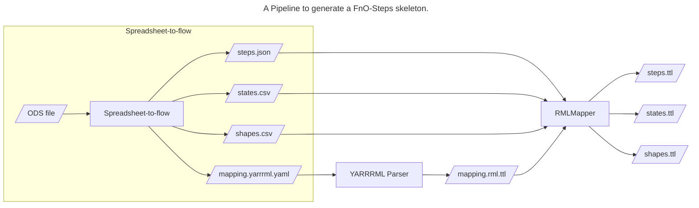
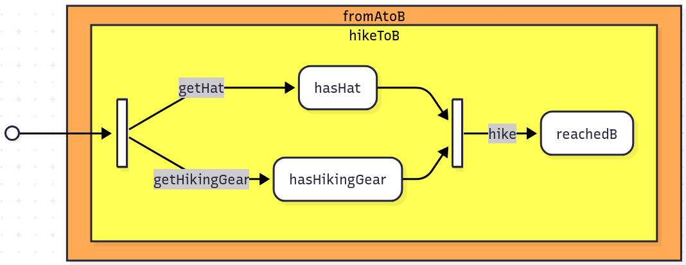

# Spreadsheet-to-(Work)flow

Spreadsheet-to-flow is a CLI tool as part of a pipeline to generate a 
[FnO-Steps](https://spec.knows.idlab.ugent.be/fno-steps/latest/) workflow
skeleton from a description of *steps* and *states* in a spreadsheet.
In the generated flow a *state* has a corresponding *shape* which
checks for a default (also generated) SHACL *predicate path* in the data.
These generated shapes need to be customized to reflect the actual conditions.



Spreadsheet-to-flow takes an ODS file as input and generates the files
`steps.json`, `states.csv`, `shapes.csv` and a corresponding
[YARRRML](https://rml.io/yarrrml/) mapping file `mapping.yarrrml.yaml`.

The generated YARRRML mapping file contains some default mappings to
generate a working FnO-Steps workflow. This mapping file can be modified
to meet the use case's needs.

The YARRRML file can then be converted to an [RML](https://rml.io/specs/rml/)
mapping file with [YARRRML Parser](https://github.com/rmlio/yarrrml-parser).

An RML mapping engine such as [RMLMapper](https://github.com/RMLio/rmlmapper-java)
then takes the RML mapping file together with the generated data files as input
and generates an FnO-Steps flow as output, consisting of
`steps.ttl`, `states.ttl` and `shapes.ttl`

## Running the complete pipeline with Docker / Podman
A container which contains Spreadsheet-to-flow, YARRRML Parser and RMLMapper is provided (with `Dockerfile`).
It is tested on [Docker](https://www.docker.com/) and [Podman](https://podman.io/).

Build the container (`docker` can be replaced with `podman`):

```shell
docker build -t stf .
```

Run the container (this example generates the flow of `test-resources/testflow.ods`):

```shell
cd test-resources
docker container run -v "$(pwd)":/mnt/data --rm stf testflow.ods
```

All generated files will appear in `test-resources/testflow_output`.

## Running locally

### Only Spreadheet-to-flow

If you only want to run Spreadsheet-to-flow, install [Rust](https://www.rust-lang.org/tools/install).
To build Spreadsheet-to-flow, run

```shell
cargo build --release
```

This will prodice a binary `target/release/spreadsheet-to-flow`
 
Alternatively, run

```shell
cargo install --path .
```
This will build a binary and put it on the PATH environment variable,
so you can invoke `spreadsheet-to-flow` globally.

### The complete pipeline

To run the pipeline *Spreadsheet-to-flow* --> *YARRRML Parser* --> *RMLMapper*
some extra things need to be on your system:
- a Java JRE / JDK >= 18
- Node.js (runs on 22)

Then install YARRRML Parser and RMLMapper and build Spreadsheet-to-flow:
```shell
./install.sh
```
This will install YARRRML Parser and RMLMapper locally in `./bin/`, and will build
`spreadsheet-to-flow`.

The script `run.sh` provides an easy way to run the pipeline:
```shell
./run.sh path/to/spreadsheet.ods
```

**Note**: If you already have YARRRML Parser and / or RMLMapper installed
on your system (so not in `./bin/`) adjust the variables
`YARRRMLPARSER` and `RMLMAPPER` in `run.sh` to point to the right paths.


## Layout of the spreadsheet

### A flow example
We'll explain how the spreadsheet looks like for the flow in `test-resources/example.ods`

The situation is: you want to hike to a place called `B`, but before you
can start hiking, you have to be equiped with a hat and some other gear.


```
%% This Mermaid diagram doesn't render in this version of GitLab; see picture below
flowchart LR
        A@{shape: sm-circ}
        A --> B@{shape: fork}
        subgraph fromAtoB
        style fromAtoB fill:#fa5
        subgraph hikeToB
        style hikeToB fill:#ff5
        B --> |getHat| HH(hasHat)
        B --> |getHikingGear| HHH(hasHikingGear)
        HH --> C@{shape: join}
        HHH --> C
        C --> |hike| RB(reachedB)
        end
        end
```



In FnO-Steps terminology, the start state is called **the empty state** (the circle at the left).
The end state is called a **goal state** has a name, **reachedB** in this case.

So the most high level step (**Journey level step**) to get from *empty* to *reachedB* is **fromAtoB**.
It is broken down in a **Container level step hikeToB** which happens to be the only one in this case.
Journey level steps can have multiple container level steps.

**hikeToB** consists of a few detailed **component level steps** and states:
- step **getHat**, which results in state **hasHat**;
- step **getHikingGear** which results in state **hasHikingGear**.
- If (the **shapes** of) states **hasHat** and **hasHikingGear** are fulfilled, the step **hike** can be performed, which results in the final state **reachedB**.

### The spreadsheet
To represent a flow the spreadsheet must have a certain format to be parsed by spreadsheet-to-flow:

It must have **two** sheets named **steps** and **states**. More sheets can be added but are ignored.

The **states** sheet must have two columns. The first row is a header with values **name** and **description**.
Here's the sheet from our example:

Example states sheet:
| name          | description                                             |
|---------------|---------------------------------------------------------|
| hasHikingGear | You have hiking gear and are ready to climb a mountain! |
| hasHat        | You have a hat, because the sun shines                  |
| reachedB      | Got to point B                                          |

The corresponding **steps** sheet has to have columns **name, description, levels, start_states** and **end_states**.
It looks like (for this example):

| name          | description                                           | levels    | start_states          | end_states    |
|---------------|-------------------------------------------------------|-----------|-----------------------|---------------|
| fromAtoB      | Go from A to B, but there's a mountain in between...  | Journey   |                       | reachedB      |
| hikeToB       | Hike over the mountain, only if you have hiking gear  | Container |                       | reachedB      |
| getHat        | You get a hat because the sun shines                  | Component |                       | hasHat        |
| getHikingGear | You grab your hiking gear                             | Component |                       | hasHikingGear |
| hike          | You're reaching B                                     | Component | hasHat, hasHikingGear | reachedB      |

- The very first state is the **empty state** and is just an empty cell in the spreadsheet.
- A step can have 1 or more **start states** and 1 or more **end states**.
- There are three levels a step can have: **Journey** (high level), **Container** (medium level), and **Component** (low level).
  These are the possible levels a single step can have:

| Journey | Container | Component |
|---------|-----------|-----------|
| [ x ]   |           |           |
| [ x ]   | [ x ]     |           |
| [ x ]   | [ x ]     | [ x ]     |
|         | [ x ]     | [ x ]     |
|         | [ x ]     |           |
|         |           | [ x ]     |
